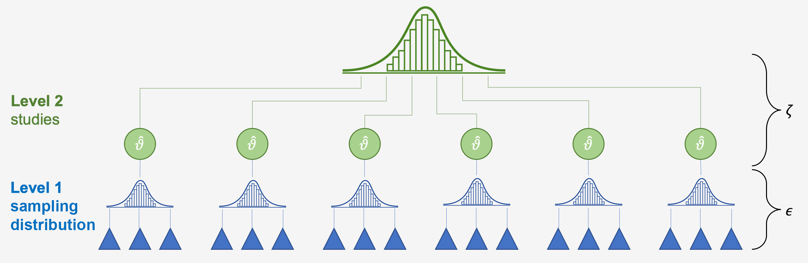

# "Multilevel" Meta-Analysis


$$ $$

By the time you reach this chapter, you have already fitted a multilevel meta-analytic model several times. This is because the meta-analytic random-effects model is, by definition, a two-level multilevel model. When people talk about "multilevel meta-analysis", however, they more commonly  what they often think of are **three-level meta-analytic models**. We introduce these here, because they are an excellent and convenient solution to the problem of **dependent data**: The situation that arises when you extract several effect sizes from ONE sample. For example, if a study applies one manipulation, and measures three similar dependent variables, then you can calculate three effect sizes from that study, which will be **dependent**. The best way to account for this dependency is by taking the sampling **covariance** (similar to the sampling variance of each effect size) between the effect sizes into account. This information is almost never reported by the original authors, however, so a very attractive solution is the three-level multilevel approach [@vandennoortgateMetaanalysisMultipleOutcomes2015], which merely assumes that the sampling covariances are the same between all pairs of effect sizes in all studies.


## Meta-Analysis is multi-level (optional)

To see why meta-analysis is by nature multileveled, let us go back to the formula for the random-effects model we discussed in [Chapter 5.2](#random):

$$\hat\theta_k = \mu + \epsilon_k + \zeta_k$$

We discussed that the terms $\epsilon_k$ and $\zeta_k$ are introduced in a random-effects model because we assume that there are two sources of variability. The first one is caused by the **sampling error** ($\epsilon_k$) of individual studies, which causes their effect size estimates to deviate from the true effect size $\theta_k$. The second one, $\zeta_k$ is the between-study heterogeneity caused by the fact that the true effect size of a study $k$ itself is again only part of an **overarching distribution of true effect sizes**, from which the individual true effect size $\theta_k$ was drawn. Our aim in the random-effects model is therefore to estimate the mean of this distribution of true effect sizes, $\mu$.

The two error terms correspond with the two levels within our meta-analysis data: the **"participant" level** (level 1) and the **"study" level** (level 2). The figure below symbolizes this structure. In the lower level (level 1), we have the participants (and/or patients). These participants are, of course, part of a number of larger units, the studies (level 2), from which we retrieved the data for our meta-analysis. While the data on level 1 usually already reaches us, the meta-analysts, in a "pooled" form (e.g., the authors of the paper provide us with the mean and standard deviation of their studied sample instead of the raw data), pooling on level 2, the study level, has to be performed in meta-analysis. In the tradition of multilevel modeling, such data is called **nested data**: in most meta-analyses, one can say that **participants are "nested" within studies**.



Thus, if we split the formula from above into the components corresponding to the two levels, we get the following formulae:

**Level 1 (participants) model:**

\begin{equation}
  \label{eq:1}
  \hat\theta_k = \theta_k + \epsilon_k
\end{equation}

**Level 2 (studies) model:**

\begin{equation}
  \label{eq:2}
  \theta_k = \mu + \zeta_k
\end{equation}

You might have already detected that we can substitute $\theta_k$ in the first equation with its definition in the second equation. What we then get is **exactly the generic formula for the meta-analytic model from before** (even a fixed-effects model can be defined as having a multilevel structure, yet with $\zeta_k$ being zero). Thus, it becomes evident that the way we define a meta-analytic model already has multilevel properties "built-in" given that we assume that participants are nested within studies in our data.  

<br><br>

---


### Three-level meta-analytic models

It has become clear that meta-analysis naturally possesses a multilevel structure. This allows us to expand this structure even further to better reflect our data. **Three-level models** [@cheung2014modeling; @assink2016fitting] are a good way to do this.

**Statistical independence** is one of the core assumptions of meta-analytic pooling [@hedges2009statistical]. If there is a dependency between effect sizes (i.e., the effect sizes are correlated), this may artificially reduce heterogeneity and thus lead to false-positive results.  

Dependence may stem from different sources [@cheung2014modeling]:

1.  **Dependence introduced by the authors of the individual studies**. For example, scientists conducting the study might have collected data from multiple sites, or they might have compared [multiple interventions to one single control group](#i), or they might have used different questionnaires to measure an outcome of interest (e.g., they used the BDI as well as the PHQ-9 to assess depression in patients). For all of these scenarios, we can assume that some kind of dependency is introduced within the reported data.
2.  **Dependence introduced by the meta-analyst herself**. For example, a meta-analysis could focus on a specific psychological mechanism and include studies which were conducted in different cultural regions of the world. It seems reasonable that the reported results are more similar when studies were conducted in the same cultural context.

We can take such dependencies into account by integrating a **third layer** into the structure of our meta-analysis model. For example, one could model that different questionnaires are nested within studies. Or one could create a model in which studies are nested within cultural regions. This creates a three-level meta-analytic model, as illustrated by the figure below.


The generic mathematical formulae for a three-level meta-analytic model look like this:

**Level 1 model**

$$\hat\theta_{ij} = \theta_{ij} + \epsilon_{ij}$$

**Level 2 model**

$$\theta_{ij} = \kappa_{j} + \zeta_{(2)ij}$$

**Level 3 model**

$$\kappa_{j} = \beta_{0} + \zeta_{(3)j}$$

Where $\theta_{ij}$ is the **true effect size**, $\hat\theta_{ij}$ its estimator in the $i$th effect size in cluster $j$, $\kappa_{j}$ the **average effect size** in $j$ and $\beta_0$ the average population effect. Again, we can piece these formulae together and get this:

$$\hat\theta_{ij} = \beta_{0} + \zeta_{(2)ij} + \zeta_{(3)j} + \epsilon_{ij}$$


## Fitting a three-level model

The `metafor` package is particularly well suited for fitting various three-level models in meta-analyses.

### Data preparation

For this chapter, we continue to use the `curry` dataset from `metaforest`, which we have assigned to the object `df`. It has already been prepared for multilevel model fitting: Let's have a peek at the dataset.

```{r, echo=FALSE}
library(metaforest)
df <- curry
```

```{r}
# Load the package, if you haven't yet
library(metaforest)
# Assign the curry dataset to df, if you haven't yet
df <- curry
# Examine the first 6 rows of the data
head(df)
```

We see that the first two columns of the dataset are ID variables:

* **study_id** and **effect_id**. In these two columns, we stored the identifiers corresponding to the individual effect sizes, and we will use the studies as clusters on different levels of our multilevel model. 

<!--There are two additional columns which contain data needed for **subgroup analyses**. To conduct subgroup analyses with `metafor`, however, we need to store the data a little differently than in [Chapter 7](#subgroup). This time, we do not use a factor vector containing the subgroup levels as strings, but **recode all subgroup levels** as individuals columns in the data. In our case, we are interested if the publication status has a moderating effect on the pooled results. We want to compare studies published in peer-review journals to dissertations. To do this, we need to create **two variables/columns for each subgroup level** (peer-review, dissertation). In each column we provide a code if the effect size belongs to this subgroup, defined by `1 = yes` and `0 = no`. Of course, the subgroup codings now have to be **mutually exclusive**, as we cannot calculate subgroup effects if a study is both part of the "peer-review" group and the "dissertation" group.  -->

```{block,type='rmdinfo'}
Multilevel models can accommodate different sources of heterogeneity, too. Maybe you have effect sizes originating in different countries, or maybe you want to cluster by (team of) authors. Just replace the study_id with **your** cluster id, in those cases. It is even possible to have more levels added (e.g., effect sizes within studies within countries), although that is beyond the scope of this tutorial.
```

### Model fitting

We are now prepared to fit our model. I will save the model to the object `m_multi`. For model fitting, we use the `rma.mv` function in `metafor`. This is a *more technical* interface than the standard `rma` function. The function has plenty of parameters one can specify (type `?metafor::rma.mv` in the console to see them all). For now, we will only focus on the really essential ones.

```{r,echo=FALSE, warning=FALSE, message=FALSE}
library(knitr)
Code<-c("yi", "V", "random", "data", "method")
Description<-c("The variable in our dataset containing the effect size data", "The variable in our dataset containing the sampling variance data corresponding to each y", "The model specifications for our multilevel model. We describe this in more detail below" , "The data.frame containing our data", "The tau-squared estimator. Our options here are limited, and it is advised to use the restricted maximum likelihood ('REML') method, which is the default")
m<-data.frame(Code,Description)
names<-c("Code","Description")
colnames(m)<-names
kable(m)
```

**Setting up the formula**

Under the `random` parameter, we feed `rma.mv` with the formula for the random effects in our model. As we actually have two formulas in three-level models, we have to bundle them together in a `list()`. The notation for `rma.mv` is very similar to other packages specialized for mixed-effects models such as `lme4` [@lme4]. 

Within the `list()`, formulae are separated with commas. Within the formula, we first define the random effects variance as `~ 1`, followed by a **vertical bar** `|`. Behind the vertical bar, we assign this random effect to a **grouping variable** such as studies, measures, regions and so forth. We only have to define the formulae for **level 2** and **level 3**. The sampling variance in level 1 is assumed to be known; this is a necessary assumption in three-level meta-analysis, because we don't have the raw data. Without this assumption, the model would not be identified. We type in the formulae in the order of our multilevel model. As in our example, ID_2 is nested in ID_1, we first define level 2 as `~ 1 | ID_2` and then level 3 as `~ 1 | ID_1`. Now, let's put it all together:


```{r}
m_multi <- rma.mv(d, vi, random = list(~ 1 | effect_id, ~ 1 | study_id), data = df) 
m_multi
```

Let's go through the output one by one. First, let's have a look at the `Variance Components`. Here, we see the variance calculated for each level of our model, $\sigma^2_1$ (level 2) and $\sigma^2_2$ (level 3). Under `nlvls`, we see the number of levels (i.e., subgroups) on each level. The number 56 corresponds to the number of unique effect sizes, and 27 is the number of unique studies. The heading `factor` is the best clue as to what levels these are: effect_id is the within-studies variance componend, and study_id is the between-studies variance component. 

Under `Model Results`, we see the `estimate` of our pooled effect, which is 0.2836. As our `y` column contained effect sizes expressed as Hedges' g, the effect is therefore $g = 0.2836.$, with a confidence interval of $0.16-0.41$. 

Under `Test for Heterogeneity`, we see that the variance of effect sizes within our data overall was significant ($p < 0.001$). This however, is not very informative as we are interested how variance can be attributed to the different levels in our model.


### Distribution of total variance

As mentioned before, what we're actually interested in is the **distribution of variance over the three levels of our model**. Cheung (2014) provides a formula to estimate the sampling variance, which is needed to calculate the variance proportions for each level. We have have programmed a function called `variance_decomposition`, which implements this formula. The code for the function can be seen below. Parts of this code were adapted from Assink and Wibbelink [@assink2016fitting].

R doesn't know this function yet, so we have to let R learn it copying and pasting the code underneath **in its entirety** into the **console** on the bottom left pane of RStudio, and then hit **Enter ⏎**.

```{r, fig.height=3}
variance_decomposition <- function(m){
    n <- m$k
    vector.inv.var <- 1/(diag(m$V))
    sum.inv.var <- sum(vector.inv.var)
    sum.sq.inv.var <- (sum.inv.var)^2
    vector.inv.var.sq <- 1/(diag(m$V)^2)
    sum.inv.var.sq <- sum(vector.inv.var.sq)
    num <- (n-1)*sum.inv.var
    den <- sum.sq.inv.var - sum.inv.var.sq
    est.samp.var <- num/den
    if(length(m$sigma2) > 2) stop("Cannot handle more than three levels.")
    total_var <- (sum(m$sigma2)+est.samp.var)/100
    Variance <- c(est.samp.var, m$sigma2)/total_var
    names(Variance) <- c("Level1", m$s.names)
    Variance
}
```

Let's have a look:

```{r}
variance_decomposition(m_multi)
```


From the outputs, we see that about 24.45% of the overall variance can be attributed to level 1, 0% to level 2 (within-study variance), and as much as 75.55% to level 3 (between-study variance). 

### Comparing the fit

Of course, when fitting a three-level model, we are interested if this model actually **captures the variability in our data better than a two-level model**. `metafor` allows us to easily do this by comparing models **in which one of the levels is removed**.

To do this, we can use the `rma.mv` function again, but this time, we hold the variance component $\sigma^2$ of one level constant at 0. This can be done by specifying the `sigma2` parameter. The parameter can be specified by providing a vector telling the function which level to hold constant, with the generic version being `c(level 2, level3)`. So, if we want to hold level 2 constant while leaving the rest as is, we use `sigma2 = c(0,NA)`, and vice versa for the third level. We can then use ANOVAs to compare the fit of these models.

```{r, echo = TRUE}
m_within_null <- rma.mv(yi = d, V = vi, random = list(~ 1 | effect_id, ~ 1 | study_id), sigma2 = c(0, NA), data = df) 
m_between_null <- rma.mv(yi = d, V = vi, random = list(~ 1 | effect_id, ~ 1 | study_id), sigma2 = c(NA, 0), data = df)
m_both_null <- rma.mv(yi = d, V = vi, random = list(~ 1 | effect_id, ~ 1 | study_id), sigma2 = c(0, 0), data = df) 

aov_within <- anova(m_multi, m_within_null) 
aov_between <- anova(m_multi, m_between_null) 
aov_bothnull <- anova(m_multi, m_both_null) 

# Join these results in a table
aov_table <- rbind(
c(df=aov_between$p.f, aov_between$fit.stats.f[c(3:4, 1)], LRT = NA, p = NA),
c(df=aov_within$p.r, aov_within$fit.stats.r[c(3:4, 1)], LRT = aov_within$LRT, p = aov_within$pval),
c(df=aov_between$p.r, aov_between$fit.stats.r[c(3:4, 1)], LRT = aov_between$LRT, p = aov_between$pval),
c(df=aov_bothnull$p.r, aov_bothnull$fit.stats.r[c(3:4, 1)], LRT = aov_bothnull$LRT, p = aov_bothnull$pval)
)
rownames(aov_table) <- c("Three-level model", "Within-studies variance constrained", "Between-studies variance constrained", "Both variance components constrained")
```

```{r, echo=FALSE}
aov_table[,-c(1,6)] <- formatC(aov_table[,-c(1,6)], digits = 2, format = "f")
aov_table[,6] <- formatC(as.numeric(aov_table[,6]), digits = 3, format = "f")
aov_table[1, 5:6] <-""

kable(aov_table)
```

This table allows us to easily compare the models, using fit indices (AIC and BIC; lower is better), and likelihood ratio tests and p-values. The results unanimously indicate that the model with within-studies variance constrained to 0 fits the best, and that this constraint does not lead to significantly worse fit (p = 1.00). Still, the decision which model to use should be based at least as much on theory, as on statistical criteria.

<br><br>

---
