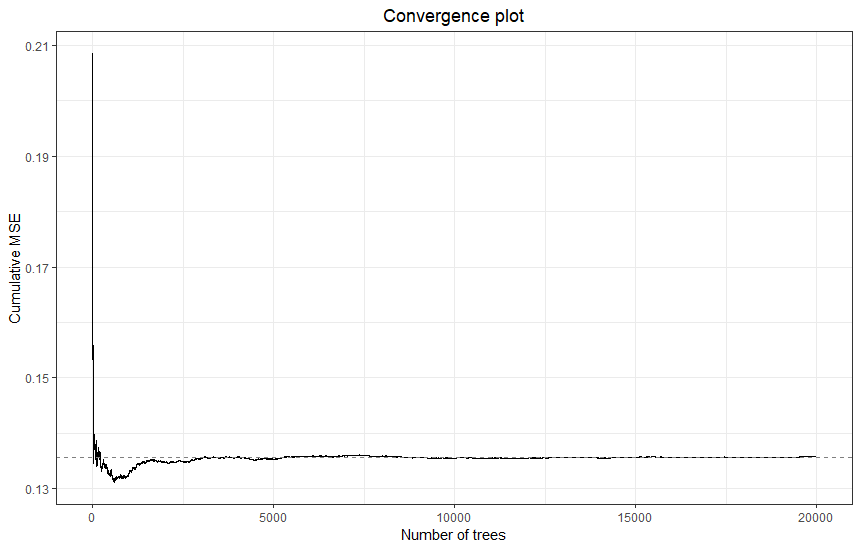
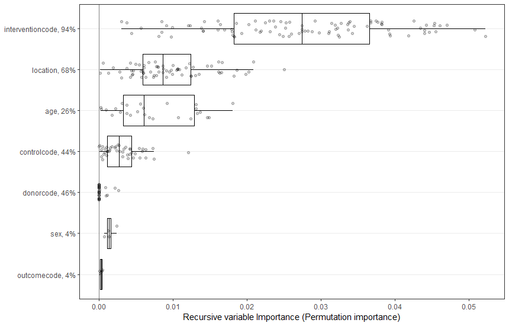
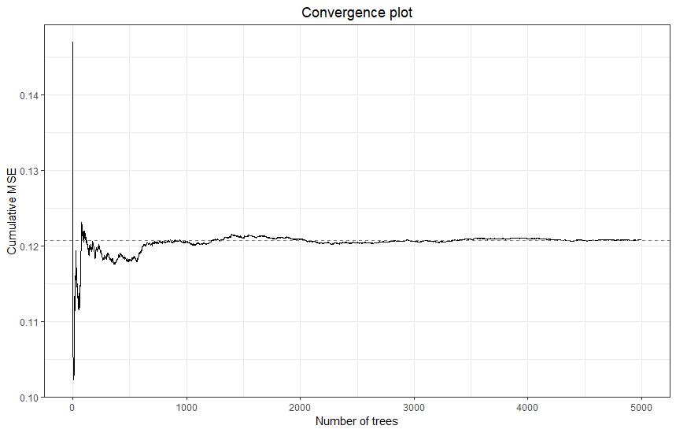
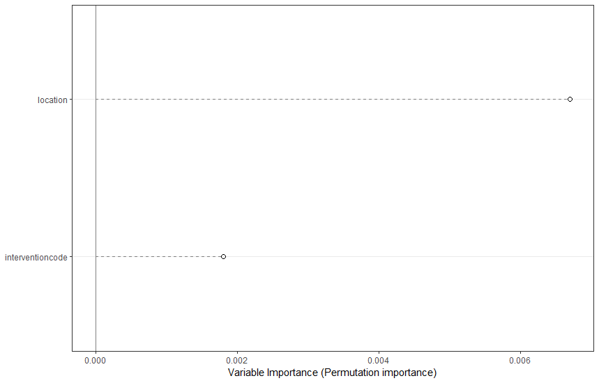
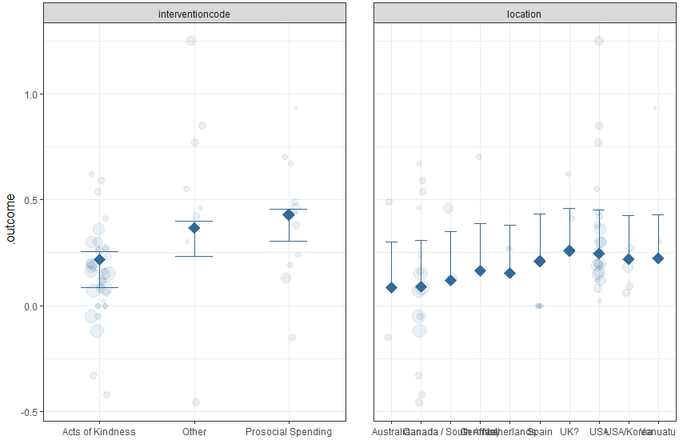
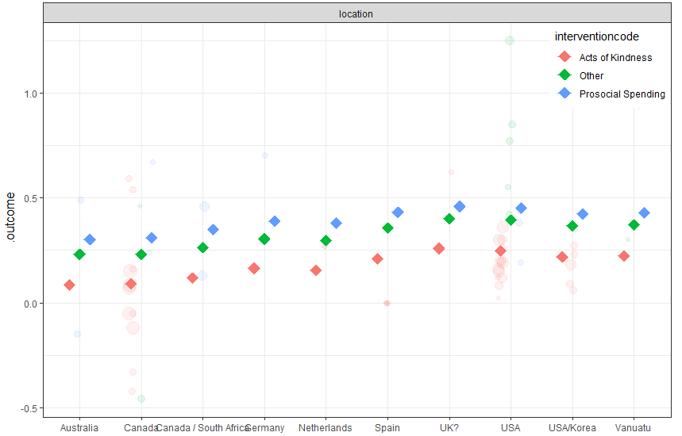

# Exploring heterogeneity {#metaforest}


This chapter is heavily based on my in-press, open access book chapter "Small sample meta-analyses: Exploring heterogeneity using MetaForest". The book does not yet have a DOI, but information about it will be anounced here:

[https://s4.wp.hum.uu.nl/](S4 conference).

A valid reference for the methods described in this chapter is @vanlissaMetaForestExploringHeterogeneity2017.

```{block,type='rmdinfo'}
In the social sciences, meta-analyses often pool research conducted in different laboratories, using different methods, instruments, and samples. Such between-studies differences can introduce substantial heterogeneity in the effect sizes found. At the same time, the sample of studies is often small, which means there is limited statistical power to adequately account for moderators that cause between-studies heterogeneity. If we just include all moderators in a meta-regression, we risk overfitting the data. In this chapter, I introduce a technique that can explore between-studies heterogeneity and perform variable selection, identifying relevant moderators from a larger set of candidates, without succumbing to overfitting: MetaForest, a machine-learning based approach to identify relevant moderators in meta-analysis [@vanlissaMetaForestExploringHeterogeneity2017].
```


## Understanding random forests

MetaForest is an adaptation of the random forests algorithm [see @stroblIntroductionRecursivePartitioning2009] for meta-analysis. Random forests are a powerful machine learning technique, with several advantages. Firstly, random forests are robust to overfitting. Secondly, they are a non-parametric technique, which means that they can easily capture non-linear relationships between the moderator and effect size, or even complex, higher-order interactions between moderators. Thirdly, random forests perform variable selection, identifying which moderators contribute most strongly to the effect size found.

The *random forest* algorithm combines many *tree models*. A tree model can be conceptualized as a decision tree, or a flowchart: The model recursively splits the data into groups with maximally similar values on the outcome variable, the study effect size. The splitting decisions are based on the moderator variables. Starting with the full dataset, the model first finds the moderator variable, and the value on that variable, along which to split the dataset. It chooses the moderator and value that result in the most homogenous post-split groups possible. This process is repeated for each post-split group; over and over again, until a stopping criterion is reached. Usually, the algorithm is stopped when the post-split groups contain a minimum number of cases.

One advantage of regression trees is that it does not matter if the number of moderators is large relative to the sample size, or even exceeds it. Secondly, trees are non parametric; they do not assume normally distributed residuals or linearity, and intrinsically capture non-linear effects and interactions. These are substantial advantages when performing meta-analysis on a heterogeneous body of literature. Single regression trees also have a limitation, however, which is that they are extremely prone to overfitting. They will simply capture all patterns in the data, both genuine effects and random noise [@hastieElementsStatisticalLearning2009].

Random forests overcome this limitation of single regression trees. First, many different bootstrap samples are drawn (say 1000). Then, a single tree is grown on each bootstrap sample. To ensure that each tree learns something unique from the data, only a small random selection of moderators is made available to choose from at each splitting point. Finally, the predictions of all tree models are averaged. This renders random forests robust to overfitting: Because each tree captures some of the true patterns in the data, and overfits some random noise that is only present in its bootstrap sample, overfitting cancels out on aggregate. Random forests also make better predictions: Where single trees predict a fixed value for each "group" they identify in the data, random forests average the predictions of many trees, which leads to smoother prediction curves.

### Meta-analytic random forests

To render random forests suitable for meta-analysis, a weighting scheme is applied to the bootstrap sampling, which means that more precise studies exert greater influence in the model building stage [@vanlissaMetaForestExploringHeterogeneity2017]. These weights can be uniform (each study has equal probability of being selected into the bootstrap sample), fixed-effects (studies with smaller sampling variance have a larger probability of being selected), or random-effects based (studies with smaller sampling variance have a larger probability of being selected, but this advantage is diminished as the amount of between-studies heterogeneity increases). Internally, `metaforest` relies on the `ranger` R-package; a fast implementation of the random forests in C++.

### Tuning parameters

Like many machine learning algorithms, random forests have several "tuning parameters": Settings that might influence the results of the analysis, and whose optimal values must be determined empirically. The first is the number of candidate variables considered at each split of each tree. The second is the minimum number of cases that must remain in a post-split group within each tree. The third is unique to MetaForest; namely, the type of weights (uniform, fixed-, or random-effects). The optimal values for these tuning parameters are commonly determined using cross-validation [@hastieElementsStatisticalLearning2009]. Cross-validation means splitting the dataset many times, for example, into 10 equal parts. Then, predictions are made for each of the parts of the data, using a model estimated on all of the other parts. This process is conducted for all possible combinations of tuning parameters. The values of tuning parameters that result in the lowest cross-validated prediction error are used for the final model. For cross-validation, `metaforest` relies on the well-known machine learning R-package `caret`.

<br><br>

---

## Using MetaForest

To illustrate how to use MetaForest to identify relevant moderators in a small sample meta-analysis, I will apply it to the `curry` data.

```{r}
# Load the metaforest package
library(metaforest)
# Select only the relevant variables from the curry data
data <- curry[, c("d", "vi", "study_id", "sex", "age", "location", "donorcode",
                  "interventioncode", "controlcode", "outcomecode")]
```

### Checking convergence
For any random forests model, it is important to check whether the model converges. Convergence is assessed by examining the cumulative mean squared out-of-bag prediction error (MSE), as a function of the number of trees in the model. When the MSE stabilizes, the model is said to have converged. To get an impression of how many trees are required to have the model converge, we will run the analysis once with a very high number. We then pick a smaller number of trees, at which the model is also seen to have definitely converged, to speed up the subsequent computationally heavy steps, such as replication and model tuning. We will examine convergence again for the final model.

```{r eval = FALSE, echo = TRUE}
# Because MetaForest uses the random number generator (for bootstrapping),
# we set a random seed so analyses can be replicated exactly.
set.seed(242)
# Run model with many trees to check convergence
check_conv <- MetaForest(d~.,
                        data = data,
                        study = "study_id",
                        whichweights = "random",
                        num.trees = 20000)
# Plot convergence trajectory
plot(check_conv)
```



It can be seen that this model has converged within approximately 5000 trees. Thus, we will use this number of trees for subsequent analyses. We now apply recursive pre-selection using the `preselect` function. This algorithm helps eliminate noise moderators by running the analysis, dropping the moderator with the most negative variable importance, and then re-running the analysis until all remaining variables have positive importance. This recursive algorithm is replicated 100-fold. Using `preselect_vars`, we retain only those moderators for which a 50% percentile interval of the variable importance metrics does not include zero (variable importance is counted as zero when a moderator is not included in the final step of the recursive algorithm).

```{r eval = FALSE, echo = TRUE}
set.seed(55)
# Model with 10000 trees for replication
mf_rep <- MetaForest(d~.,
                        data = data,
                        study = "study_id",
                        whichweights = "random",
                        num.trees = 5000)
# Run recursive preselection, store results in object 'preselect'
preselected <- preselect(mf_rep,
                         replications = 100,
                         algorithm = "recursive")
# Plot the results
plot(preselected)
# Retain only moderators with positive variable importance in more than
# 50% of replications
retain_mods <- preselect_vars(preselected, cutoff = .5)
```



We can see that only `interventioncode` and `location` have been selected.

<br><br>

---

## Model tuning

Next, we tune the model using the R-package `caret`, which offers a uniform workflow for any machine learning task. The function `ModelInfo_mf` tells caret how to tune a MetaForest analysis. As tuning parameters, we consider all three types of weights (uniform, fixed-, and random-effects), number of candidate variables at each split from 2-6, and a minimum node size from 2-6. We select the model with smallest prediction error (RMSE) as final model, based on 10-fold clustered cross-validation. Clustered cross-validation means that effect sizes from the same study are always included in the same fold, to account for the dependency in the data. Note that the number of folds cannot exceed the number of clusters in the data. Moreover, if the number of clusters is very small, one might have to resort to specifying the same number of folds as clusters. Model tuning typically takes a long time; for this small dataset, it might take five minutes; for a very large dataset, it might take hours. However, when your dataset is larger, you will often reach model convergence at a lower number of trees, which reduces computation time.

```{r eval = FALSE, echo = TRUE}
# Install the 
install.packages("caret")
# Load the caret library
library(caret)
# Set up 10-fold grouped (=clustered) CV
grouped_cv <- trainControl(method = "cv", 
                           index = groupKFold(data$study_id, k = 10))

# Set up a tuning grid for the three tuning parameters of MetaForest
tuning_grid <- expand.grid(whichweights = c("random", "fixed", "unif"),
                       mtry = 1:2,
                       min.node.size = 1:10)

# X should contain only retained moderators, clustering variable, and vi
X <- data[, c("study_id", "vi", retain_mods)]

set.seed(78)
# Train the model
mf_cv <- train(y = data$d,
               x = X,
               study = "study_id", # Name of the clustering variable
               method = ModelInfo_mf(), 
               trControl = grouped_cv,
               tuneGrid = tuning_grid,
               num.trees = 5000)
# Extract R^2_{cv} for the optimal tuning parameters
r2_cv <- mf_cv$results$Rsquared[which.min(mf_cv$results$RMSE)]
```

Based on the root mean squared error, the best combination of tuning parameters were fixed-effect weights, with 1 candidate variable per split, and a minimum of 9 cases per terminal node. The object returned by `train` already contains the final model, estimated with the best combination of tuning parameters. Consequently, we can proceed directly to reporting the results. First, we examine convergence again. Then, we examine the $R^2_{oob}$.

```{r eval = FALSE, echo = TRUE}
# For convenience, extract final model
final <- mf_cv$finalModel
# Extract R^2_{oob} from the final model
r2_oob <- final$forest$r.squared
# Plot convergence
plot(final)
```



The final model has clearly converged. We can check the two estimates of variance explained in new data: $R^2_{cv}$, which is based on the 10-fold grouped cross-validation, and $R^2_{oob}$, which is based on cases outside of the bootstrap samples of the individual trees. 

```{r eval = TRUE, echo = FALSE}
r2_cv <- .4985625
r2_oob <- -.1625724
```

```{r}
r2_cv
r2_oob
```

We can see that the $R^2_{cv} = .50$, and the $R^2_{oob} = -.16$. The negative value means that the model performs worse than just using the mean. The fact that these values differ so much suggests that perhaps our model is not detecting reliable patterns in the data. This would also correspond with the fact that none of the variables were consistently selected during the recursive preselection step. In the published paper for this meta-analysis, we bootstrapped the entire analysis 100 times, and showed that the average bootstrapped $R^2$ was around 0. So we concluded that none of the moderators were relevant.

For the sake of this exercise, we still continue exploring, however!

### Variable importance

variable importance metrics, which quantify the relative importance of each moderator in predicting the effect size. These metrics are analogous in function to the (absolute) standardized regression coefficients (beta; $\mid\beta\mid$) in regression: They reflect the strength of each moderator's relationship with the outcome on a common metric. However, whereas betas in regression only reflect linear, univariate, partial relationships, MetaForest's variable importance metrics reflect each moderator's contribution to the predictive power of the final model across all linear-, non-linear-, and interaction effects. So-called *permutation importance* is obtained by randomly permuting, or shuffling, the values of a moderator, thereby anulling any relationship that moderator had with the outcome, and then observing how much the predictive performance of the final model drops. If predictive performance drops a lot, the moderator must have been important.

Plot the variable importance:

```{r, eval = FALSE}
# Plot variable importance
VarImpPlot(final)
```


### Partial dependence

Partial dependence plots visualize the shape of the marginal relationship of each moderator to the effect size, averaging over all values of the other predictors. Researchers most commonly inspect only univariate marginal dependence plots. Exploring all possible higher order interactions swiftly becomes unmanageable; with just 10 moderators, the number of bivariate interactions is 45, and the number of trivariate interactions is 120. In order to plot bivariate interactions with a specific moderator of theoretical relevance, you can use the `PartialDependence` function in conjunction with the `moderator` argument.

Because this is an exploratory, non-parametric analysis, we cannot conclude whether any of these findings are "significant". However, the `PartialDependence` function has two settings that help visualize the "importance" of a finding: `rawdata`, which plots the weighted raw data (studies with larger weights are plotted with a larger point size), thereby visualizing the variance around the mean prediction, and `pi`, which plots a (e.g., 95%) percentile interval of the predictions of individual trees in the model. This is not the same as a confidence interval, but it does show how variable or stable the model predictions are. 

```{r eval = FALSE}
PartialDependence(final, rawdata = TRUE, pi = .95)
```



The partial dependence plots show that acts of kindness had a somewhat smaller effect than other interventions, and that studies conducted in the USA had slightly higher effects than others. But there are some factor levels with very few cases, and there is a lot of overlap between the distributions across levels. Thus, it is not surprising that we found no significant effect of location in the meta-regression model of earlier exercises.

Finally, if you want to explore bivariate interactions, you can specify **one** moderator variable. With this dataset, this plot does not make much sense, because there is so much missing data in combinations of factors. But the syntax for a moderated partial dependence plot is:

```{r eval = FALSE}
PartialDependence(final, moderator = "interventioncode",
                  rawdata = TRUE, pi = .95)
```




<br><br>

---

## What to report

The preceding paragraphs offer a step-by-step instruction on how one might go about conducting a MetaForest analysis on a small sample meta-analytic dataset. One could simply apply these steps to a different dataset. However, reporting each step in detail might raise more questions than it answers, especially with readers and Reviewers unfamiliar with the machine learning approach in general, and MetaForest in specific. At the same time, it is essential that the analysis process is reproducible and transparent. This can be achieved by publishing the entire annotated syntax of the analysis as supplementary material, for example, on the Open Science Framework (www.osf.io). In fact, best practice would be to go one step further, and share the full data along with the syntax. In the text of the paper, one might then simply report a summary of the analysis, and provide a hyperlink to the DOI of the OSF page. The part of the results section describing the MetaForest analysis might read something like this:

*"We conducted an exploratory search for relevant moderators using MetaForest: a machine-learning based approach to meta-analysis, using the random forests algorithm [@vanlissaMetaForestExploringHeterogeneity2017]. Full syntax of this analysis is available on the Open Science Framework, DOI:10.17605/OSF.IO/XXXXX. To weed out irrelevant moderators, we used 100-fold replicated feature selection, and retained only moderators with positive variable importance in > 10\% of replications. The main analysis consisted of 10.000 regression trees with fixed-effect weights, four candidate variables per split, and a minimum of three cases per terminal node. The final model had positive estimates of explained variance in new data, $R^2_{oob} = \dots$, $R^2_{cv} = \dots$. The relative importance of included moderators is displayed in Figure X. The shape of each moderator's marginal relationship to the effect size, averaging over all values of all other moderators, is illustrated in Figure XX."*

<br><br>

---
